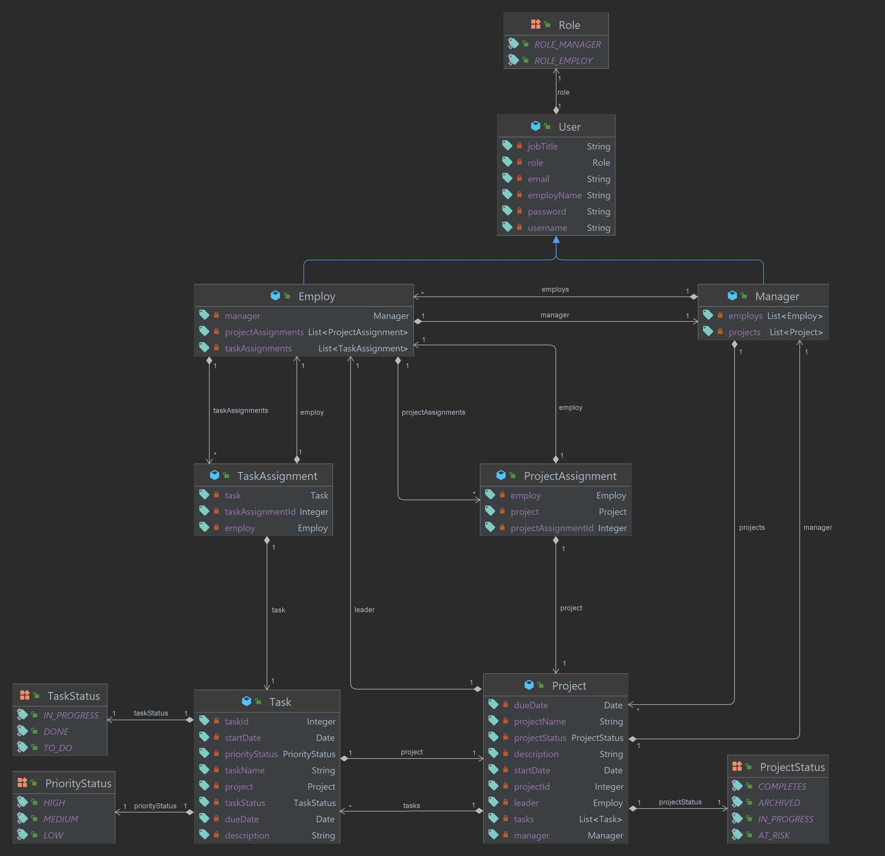

# TaskFlow
TaskFlow is a practical project that offers hands-on experience in developing a web application for task and project management with a strong focus on collaboration. By using CRUD operations, managing user profiles, and integrating real-time updates through the Spring framework, TaskFlow empowers users to streamline their work and personal projects efficiently.

<br>

## 📝 Class Diagram

<br>

## 📝 Use Case Diagram

<br>

## 📦 Prerequisites
- JDK Java 17 
- Any IDE support Java and Spring Boot
- MySQL 8.0
- MySQL Workbench 8.0
- Postman

  <br>
  
## 🔧 Setup
1. Clone the repository to your local machine.
2. Install the necessary dependencies.  
3. Set up your MySQL database and update the `application.properties` file with your database credentials:
   
   ```
    spring.datasource.url=jdbc:mysql://localhost:3306/task_flow_schema
    spring.datasource.username=username
    spring.datasource.password=password
    spring.datasource.driver-class-name=com.mysql.cj.jdbc.Driver
    spring.jpa.hibernate.ddl-auto=update
    spring.jpa.show-sql=true
    server.error.include-stacktrace=never
   ```
4. Run the application.
5. Import the Postman collection from [HERE](https://restless-desert-450152.postman.co/workspace/Team-Workspace~520315af-b391-468e-8ef1-10c57a0ce45b/collection/26776231-ee28c9ce-85a9-454f-b7dd-96ab438c65c9?action=share&creator=26776231) its have all the endpoints.


<br> 

## 💻 Technology used
- Backend Development: Spring Web with JDK Java 17
- Data Persistence: Spring Data JPA
- Managing Database: MySQL Workbench
- Authentication and Authorization: Spring Security
- Testing the API endpoints: Postman

<br>

## 🌐 API Endpoints

### User Authentication Endpoints

| Method | URL                     | Request Headers               | Request Body                                                                     | Action                                    |
|--------|-------------------------|-------------------------------|----------------------------------------------------------------------------------|-------------------------------------------|
| POST   | /auth/sign-up           |                               | { username, email, password, employName, jobTitle },  userType: "manager" / "employ" | Register a new user                       |
| POST   | /auth/login              |                               | { username, password }                                                           | Log in and return authentication token   |
| GET    | /auth/verify             | Authorization: Bearer \<token> |                                                                                  | Verify token and return user information |

### Employ Management Endpoints

| Method | URL                          | Request Headers              | Request Body | Action                                       |
|-------------------|------------------------------|------------------------------|-|----------------------------------------------|
| PATCH             | /api/manager/invite-employ    | Authorization: Bearer \<token> | { username } | Invite an employee to the manager's team      |
| PATCH             | /api/manager/remove-employ    | Authorization: Bearer \<token> | { username } | Remove an employee from the manager's team   |
| GET               | /api/manager/get-employees    | Authorization: Bearer \<token> | | Get a list of employees under the manager   |
| GET    | /api/employ/get-contributor-employees | Authorization: Bearer \<token> |                       | Get a list of employees associated with the contributor |

### Project Management Endpoints

| Method | URL                                        | Request Headers               | Request Body             | Action                                                  |
|--------|--------------------------------------------|-------------------------------|--------------------------|---------------------------------------------------------|
| POST   | /api/projects/create-project                | Authorization: Bearer \<token> | AddProjectDTO            | Create a new project                                     |
| PATCH  | /api/projects/edit-project/{projectId}      | Authorization: Bearer \<token> | HashMap\<String, Object> | Edit an existing project                                  |
| GET    | /api/projects                                | Authorization: Bearer \<token> |                          | Get a list of projects                                     |
| GET    | /api/projects/{projectId}                   | Authorization: Bearer \<token> |                          | Get details of a specific project                         |
| DELETE | /api/projects/delete-project/{projectId}    | Authorization: Bearer \<token> |                          | Delete a project                                          |

<br>

## 🗃️ Future Work
- Users can update their profiles.
- Users can comment on tasks, share files, and have discussions.
- Users can view the recent Activity for each project.
- WebSocket for real-time task updates and notifications.
- Implement email or in-app notifications for task assignments, updates, and reminders.

<br>

## 🔗 Extra links
- [My Trello](https://trello.com/invite/b/tBnAEQNb/ATTI7d2d50d1771e2b1b9eb9f3e6f867bfbcA4259FB3/taskflow)
- [My presentation](https://www.canva.com/design/DAFyVn0L2aU/UFnpNoBAmP4_N0LAnmyuBQ/edit?utm_content=DAFyVn0L2aU&utm_campaign=designshare&utm_medium=link2&utm_source=sharebutton)

<br>

## 📚 Resources
Spring Security:
- [Spring Security 6 | How to Create a Login System with Spring Data JPA and JWTs - NEW 2023](]https://youtu.be/TeBt0Ike_Tk?si=nEiw7xYIbIqYcijW)
- [Spring Security Tutorial - NEW 2023](https://youtu.be/b9O9NI-RJ3o?si=EynGsrSMx6fFay0e)
- [Spring Security – Configuring Different URLs](https://www.baeldung.com/spring-security-configuring-urls)
- [Stack Overflow - resolve method 'antMatchers()'](https://stackoverflow.com/questions/74753700/cannot-resolve-method-antmatchers-in-authorizationmanagerrequestmatcherregis)
- [Stack Overflow - unidirectional many-to-one and cascading delete](https://stackoverflow.com/questions/7197181/jpa-unidirectional-many-to-one-and-cascading-delete)
